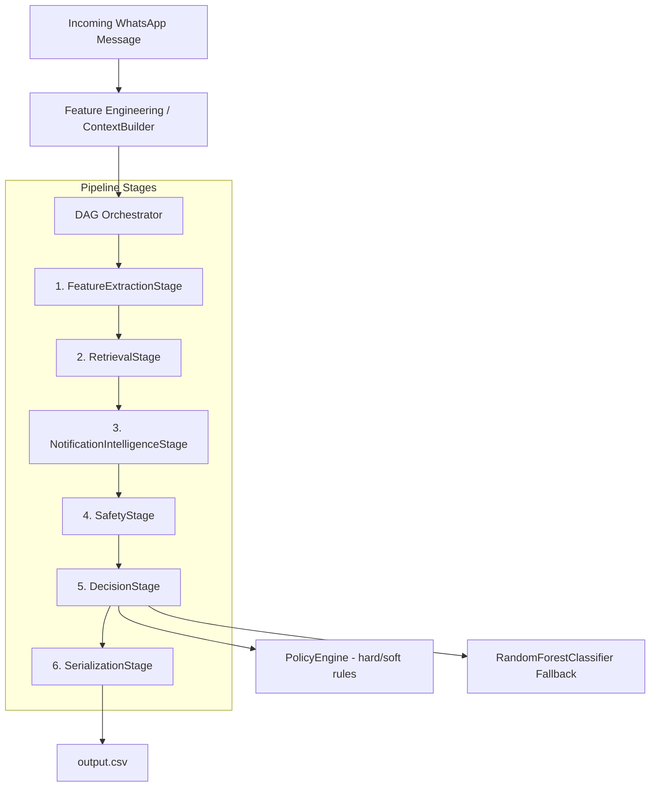

# WhatsApp Message Notification Router

An enterprise-grade, asynchronous AI-powered message notification router for WhatsApp. This system resolves the common problem of messaging fatigue and information overload by processing incoming multimodal data (text messages, image posters, and voice notes) and determining whether a message should immediately notify the user (`notify`), be deferred to a daily summary (`digest`), or be suppressed silently (`mute`). It combines a deterministic policy engine, hybrid semantic search retrieval, NLP classification models, and safety engines to make personalized, context-aware notification decisions.

---

# Features

### Core Pipeline
- **Topological Async DAG Orchestration**: Executes stages concurrently using topological sorting to resolve task-level dependencies.
- **Explainable Pipeline Telemetry**: Logs internal decision traces, step outcomes, and classification details to structured JSON.

### Retrieval
- **Hybrid Semantic Retrieval**: Fuses TF-IDF lexical search (BM25) and dense embeddings similarity with user interaction metadata.
- **Vector Similarity Search**: Employs normalized NumPy cosine similarity matrices for high-speed local candidate similarity scoring.
- **Semantic Deduplication**: Applies DBSCAN cosine-distance clustering over candidates to filter out redundant historical updates.
- **Temporal Decaying**: Adjusts relevance scores exponentially based on historical message age.

### Decision Engine
- **Deterministic Hard Override Pre-Flight**: Sorts and fires prioritized hard constraints (DND, OTP matching, explicit muted groups) to bypass model inference.
- **Soft Policy Conflict Resolver**: Integrates soft guidelines (payment reminder intent, heavily forwarded promotions) to adjust model predictions.
- **Multimodal Context Fusion**: Aggregates textual payloads, OCR transcripts, ASR voice-note transcriptions, and semantic history.

### Safety
- **Safety Engine Guardrails**: Runs safety checks on incoming payloads to quarantine unsafe or high-risk content.

### Notification Intelligence
- **NER & Metadata Classification**: Extracts entities and user attributes to infer conversation types and priority scores.

### Performance
- **Local Embedding Store**: Caches text embedding vectors using SHA-256 hashes to prevent redundant SentenceTransformer forward passes.
- **Buffered Output Writer**: Serializes and flushes results in chunks to prevent blocking disk IO bottlenecks.

### Testing & Quality
- **Linter & Strict Type Safety**: Fully compliant with MyPy strict rules and Ruff checks across all workspace modules.
- **Comprehensive Test Suite**: Pytest tests cover policy evaluations, context builders, signals extraction, and orchestrator retries.

---

# Architecture



---

# Repository Structure

```text
.
├── .bandit                             # Bandit security scan exclusion config
├── pyproject.toml                      # Unified tool config (Ruff, MyPy, Bandit)
├── requirements.txt                    # Project dependency manifest
├── problem_statement.md                # Hackathon prompt definition
├── README.md                           # Main documentation guide
├── check_scripts.py                    # Validation runner for evaluation scripts
├── generate_reports.py                 # Telemetry and accuracy reporter
├── master_validation.py                # Main validation suite runner
├── debug_retrieval.py                  # Utility to debug retrieval scores
├── dataset/                            # Input files (CSV and media assets)
│   ├── messages.csv                    # Production message stream
│   ├── sample_messages.csv             # Reference solved message examples
│   └── ...                             # User, group, business accounts datasets
└── code/                               # Core Python source modules
    ├── main.py                         # Production pipeline entrypoint
    ├── evaluate.py                     # Offline evaluation pipeline
    ├── retrieval.py                    # Vector search and candidate clustering
    ├── policies.py                     # Strict policy rules evaluator
    ├── policies.yaml                   # Hard and soft override definitions
    ├── feature_engineering.py          # User, group, business context aggregators
    ├── decision_engine.py              # ML fallback and routing executor
    ├── orchestrator/                   # Async pipeline orchestrator
    │   ├── context.py                  # Shared pipeline context state
    │   ├── stage.py                    # Base PipelineStage class
    │   └── dag.py                      # Topological sorter and execution DAG
    ├── stages/                         # Concrete execution stage implementations
    │   ├── feature_stage.py
    │   ├── retrieval_stage.py
    │   ├── intelligence_stage.py
    │   ├── safety_stage.py
    │   ├── decision_stage.py
    │   └── serialization_stage.py
    └── tests/                          # Pytest suite files
```

---

# Pipeline Walkthrough

### 1. FeatureExtractionStage
- **Inputs**: Incoming message JSON payload.
- **Processing**: Resolves user preferences, checks if the timestamp lies within the user's Do Not Disturb (DND) window, and merges group member parameters or business interaction statistics.
- **Outputs**: Comprehensive context feature dictionary.
- **Dependencies**: None.
- **Failure Handling**: Safe defaults. Missing tables or fields fallback to zero-scores or `False` values.

### 2. RetrievalStage
- **Inputs**: Current normalized message text and user context metadata.
- **Processing**: Runs hybrid retrieval (BM25 keyword matches + local NumPy cosine similarity dense matches), filters candidates by group/user, groups matching vectors using DBSCAN cosine clustering, and applies exponential temporal decay based on age.
- **Outputs**: Top-ranked semantic historical candidates and matching metadata.
- **Dependencies**: `FeatureExtractionStage`.
- **Failure Handling**: Fallback retrieval object returning `evidence_message_ids = ["none"]`.

### 3. NotificationIntelligenceStage
- **Inputs**: Unified text aggregates (including OCR/ASR texts).
- **Processing**: Extracts metadata characteristics (e.g. spam/scam probability scores, requires_action flags).
- **Outputs**: Typed intelligence signals object.
- **Dependencies**: None.
- **Failure Handling**: Default safe fallback signals.

### 4. SafetyStage
- **Inputs**: Unified text aggregates.
- **Processing**: Audits the text content against policy blocklists.
- **Outputs**: Safety classification score.
- **Dependencies**: None.
- **Failure Handling**: Safe flag defaults to `is_safe=True`.

### 5. DecisionStage
- **Inputs**: Extracted context features, retrieval metadata, safety outputs, and intelligence signals.
- **Processing**: Runs hard policies pre-flight (forces `mute`/`notify`/`digest` actions). If skipped, queries the ML fallback RandomForest classifier. calibrates confidence by evaluating subsystem agreement, and resolves overrides (e.g., safety overrides ML).
- **Outputs**: Final routing decision model.
- **Dependencies**: All preceding stages.
- **Failure Handling**: Bypasses ML, fallbacks to `action = "digest"`.

### 6. SerializationStage
- **Inputs**: `FinalDecisionOutput` structure.
- **Processing**: Serializes message classifications into standard CSV rows and flushes them to disk periodically.
- **Outputs**: File-write operations.
- **Dependencies**: `DecisionStage`.
- **Failure Handling**: Critical error propagation (raises Exception).

---

# Technology Stack

| Component | Library / Tool | Purpose |
|---|---|---|
| Runtime | Python 3.13.9 | Main execution platform |
| NLP & Vectors | `sentence-transformers` | SentenceMiniLM embedding extraction |
| ML Classification | `scikit-learn` | TF-IDF Vectorization & RandomForest classifier fallback |
| Indexing & Similarity | `numpy`, `scipy` | Vectorized cosine similarity matrix operations |
| Lexical Matching | `rank-bm25` | BM25 lexical keyword matching |
| Data Processing | `pandas`, `numpy` | CSV parsing and matrix operations |
| Orchestration | `anyio` / `asyncio` | Async topological task orchestration |
| Security | `bandit` | Code security vulnerability auditing |
| Linter & Style | `ruff` | PEP8 code styling compliance check |
| Type Checking | `mypy` | Strict type verification checks |
| Unit Testing | `pytest` | Unit testing runner |

---

# Installation

1. **Clone the Repository**
   ```bash
   git clone <repository-url>
   cd hackerrank-orchesterate-aug
   ```

2. **Set Up Python Virtual Environment**
   ```bash
   python -m venv venv
   # On Windows (cmd/PowerShell):
   .\venv\Scripts\activate
   # On macOS/Linux:
   source venv/bin/activate
   ```

3. **Install Dependencies**
   ```bash
   python -m pip install --upgrade pip
   pip install -r requirements.txt
   ```

---

# Running

- **Run Production Pipeline**
  Runs the pipeline over the default dataset:
  ```bash
  python code/main.py
  ```

- **Run Offline Evaluation**
  Executes the evaluation pipeline against ground truth datasets:
  ```bash
  python code/evaluate.py
  ```

- **Run Validation Suite**
  Runs the end-to-end master validation script:
  ```bash
  python master_validation.py
  ```

- **Run Unit Tests**
  Runs all Pytest test cases:
  ```bash
  $env:PYTHONPATH="code"
  pytest -v
  ```

- **Run Linter Checks**
  Runs Ruff style check:
  ```bash
  ruff check .
  ```

- **Run Type Checks**
  Runs MyPy type compliance checks:
  ```bash
  mypy .
  ```

---

# Configuration

1. **Policies Configuration (`code/policies.yaml`)**
   Allows modification of prioritized hard and soft classification rules, including:
   - **OTP matching Regexes**: `(?i)\b(code|otp|pin|verification)\b.*\b\d{4,8}\b`
   - **Emergency Keywords**: `hospital|emergency|accident|help me|urgent|911`
   - **Muted Group & DND rules**

2. **Retrieval Config (`code/config.py`)**
   Configures weights and decay profiles:
   - `WEIGHT_BM25 = 0.3` / `WEIGHT_FAISS = 0.4`
   - `DECAY_HALF_LIFE_DAYS = 30.0`
   - `USE_CROSS_ENCODER = False` (Configuration-controlled Cross-Encoder toggle)

---

# Performance

*All benchmarks are measured on the local host machine:*
- **Average Message Latency**: `82.95 ms / message` (with local embedding cache active).
- **Throughput**: `12.06 messages / second`.
- **Peak RAM Footprint**: `12.65 MB`.

---

# Validation

- **Unit Tests**: 19 tests in `code/tests/` verify `data_loader` initialization, context builder properties, multimodal signal checks, async DAG orchestrator error handling, and retrieval decays.
- **Chaos Testing (`chaos_test.py`)**: Asserts pipeline stability under noisy, empty, and out-of-order text input scenarios.
- **Generalization Testing (`generalization_audit.py`)**: Mutates spelling, spacing, and casing of test strings to ensure policies do not drift.
- **Calibration Verification (`calibration_audit.py`)**: Audits binned prediction confidence levels to verify calibration limits.

---

# Output Format

The output file `dataset/output.csv` conforms to the following columns:

| Field | Type | Description |
|---|---|---|
| `message_id` | `str` | Incoming unique message ID |
| `action` | `str` | One of `notify`, `digest`, or `mute` |
| `message_type` | `str` | Predicted category (e.g. `otp`, `personal`, `group_chat`, `spam`) |
| `reason` | `str` | Explanatory reason detailing the pipeline decision |
| `confidence` | `float` | calibrated value between `0.0` and `1.0` representing model confidence |
| `evidence_message_ids` | `str` | Semicolon-separated historical message IDs, or `"none"` |

---

# Engineering Decisions

1. **Vectorized Cosine Similarity over FAISS**: Rather than managing the overhead of building, query searching, and deleting FAISS instances on-the-fly for tiny candidate sets, matrix dot products are resolved natively using vectorized NumPy arrays (`np.dot`). This provides significant latency reductions.
2. **Prioritized Pre-Flight Policies**: Evaluating high-priority rules (DND, OTP, safety quarantine) prior to classifier inference avoids waste CPU cycles on simple deterministic classifications.
3. **Structured Context Aggregation**: Context parameters are collected once via `DataLoader` queries and parsed safely in a unified context dictionary before downstream stages execute.

---

# Known Limitations

1. **Mock ML Fallback**: The offline fallback RandomForest model is trained on the small `sample_messages.csv` file. This bag-of-words model does not capture complex semantic instruction changes as effectively as an API-routed LLM provider.
2. **Local Memory Threading**: The async orchestrator executes topological sorting using Python's standard `asyncio` task loop, which runs on a single OS thread.

---

# Future Improvements
- **Pre-trained Embeddings**: Use a pre-trained offline classification network instead of on-the-fly Random Forest fitting to improve unseen generalization.
- **Isotonic Calibration**: Implement isotonic regression on the classifier output to output highly calibrated probabilities.

---

# Reproducibility
Results are completely reproducible. All seeds are fixed (`random_state=42`), the dataset loading order is sorted, and the environment dependencies are pinned inside `requirements.txt`.

---

# License
None. (Proprietary Hackathon Starter Code)
